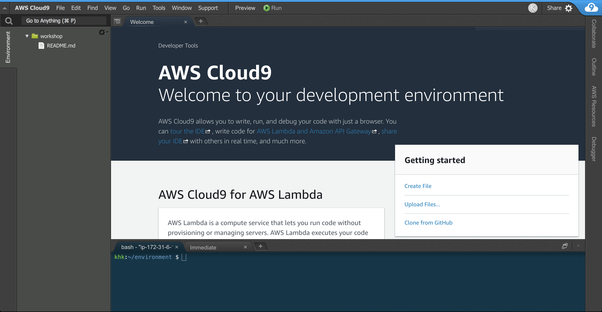

# Serverless Application with Custom Runtime
In this workshop you will deploy a simple API service that runs on AWS Lambda using custom runtimes.
You can implement an AWS Lambda runtime in any programming language. A runtime is a program that
runs a Lambda function's handler method when the function is invoked. You can include a runtime in
your function's deployment package in the form of an executable file named bootstrap.

A runtime is responsible for running the function's setup code, reading the handler name from an
environment variable, and reading invocation events from the Lambda runtime API. The runtime passes
the event data to the function handler, and posts the response from the handler back to Lambda.

Your custom runtime runs in the standard Lambda execution environment. It can be a shell script, a
script in a language that's included in Amazon Linux, or a binary executable file that's compiled in
Amazon Linux.

## Prerequisites
1. Create an AWS account
If you don't already have an AWS account, [create one now](https://aws.amazon.com/getting-started/)

## Step 0 - Setup a clean development environment
Since everyone has their own preconfigured laptops with their own customized development
environments, things could get pretty messy. So, lets use AWS Cloud9 for the sake of this lab, AWS
Cloud9 provides a hosted IDE to write, run and debug code. It also comes with awscli preinstalled!

1. In the AWS Management Console, under **Services** look for
   [Cloud9](https://ap-southeast-1.console.aws.amazon.com/cloud9/home?region=ap-southeast-1).
1. On the right, click **Create Environment**.
1. Give the Cloud9 environment a name (for example `workshop`) and leave everything else as
   standard, create your environment.
1. Once your Cloud9 environment is loaded, you should see a screen like below.


## Step 1 - Clone this repo
In your Cloud9 environment, type the following command in the **Terminal**.
```shell
$ git clone https://github.com/chankh/lambda-layers-workshop
```

After cloning the repository, you will see a new directory with the name `lambda-layers-workshop`
in the Cloud9 environment. We will execute all commands in this directory.
```shell
$ cd lambda-layers-workshop
```

## Step 2 - Deploy PHP function
We will deploy our function using the [AWS SAM CLI](https://github.com/awslabs/aws-sam-cli). First
you will need to create a S3 bucket for AWS SAM CLI to store the deployment package.
```shell
$ aws s3 mb s3://<YOUR_NAME>-workshop-php-lambda
```

Then we use the `sam package` and `sam deploy` command to package and deploy the function to AWS
Lambda. 
```shell
$ sam package \
    --template-file template.yaml \
    --output-template-file serverless-output.yaml \
    --s3-bucket <YOUR_NAME>-workshop-php-lambda

$ sam deploy \
    --template-file serverless-output.yaml \
    --stack-name my-first-serverless-php-service \
    --capabilities CAPABILITY_IAM
```

AWS SAM CLI will create the application using AWS CloudFormation. Navigate to the [CloudFormation
console](https://ap-southeast-1.console.aws.amazon.com/cloudformation/home?region=ap-southeast-1)
and you would see a stack is creating.

## Step 3 - Test your function
AWS SAM CLI had created an API for you in Amazon API Gateway. Navigate to the [API
Gateway](https://ap-southeast-1.console.aws.amazon.com/apigateway/home?region=ap-southeast-1#/)
console, you should find an API with name `my-first-serverless-php-service` under **APIs** on the
left.

Click on to `my-first-serverless-php-service` to expand it, select **Stages** then click **Prod**.
You should see an **Invoke URL** in the console. Copy the URL and paste it in a new browser
tab/window, append any text to the URL for example `test` and you should see the following response.
```
Hello World! You've reached /test
```

## Step 4 - Creating your custom function
Create a Lambda function with a custom runtime. This example includes two files, a runtime
`bootstrap` file, and a function handler. Both are implemented in Bash.

The runtime loads a function script from the deployment package. It uses two variables to locate
the script. `LAMBDA_TASK_ROOT` tells it where the package was extracted, and `_HANDLER` includes
the name of the script.

Create a new file named `bootstrap` and paste the following code into the file.
```bash
#!/bin/sh

set -euo pipefail

# Initialization - load function handler
source $LAMBDA_TASK_ROOT/"$(echo $_HANDLER | cut -d. -f1).sh"

# Processing
while true
do
  HEADERS="$(mktemp)"
  # Get an event
  EVENT_DATA=$(curl -sS -LD "$HEADERS" -X GET "http://${AWS_LAMBDA_RUNTIME_API}/2018-06-01/runtime/invocation/next")
  REQUEST_ID=$(grep -Fi Lambda-Runtime-Aws-Request-Id "$HEADERS" | tr -d '[:space:]' | cut -d: -f2)

  # Execute the handler function from the script
  RESPONSE=$($(echo "$_HANDLER" | cut -d. -f2) "$EVENT_DATA")

  # Send the response
  curl -X POST "http://${AWS_LAMBDA_RUNTIME_API}/2018-06-01/runtime/invocation/$REQUEST_ID/response"  -d "$RESPONSE"
done
```

After loading the script, the runtime processes events in a loop. It uses the runtime API to
retrieve an invocation event from Lambda, passes the event to the handler, and posts the response
back to Lambda. To get the request ID, the runtime saves the headers from the API response to a
temporary file, and reads the `Lambda-Runtime-Aws-Request-Id` header from the file.

The `function.sh` script defines a handler function that takes event data, logs it to stderr, and
returns it. Create a new file named `function.sh` and copy the following code into the file.
```bash
function handler () {
  EVENT_DATA=$1
  echo "$EVENT_DATA" 1>&2;
  RESPONSE="Echoing request: '$EVENT_DATA'"

  echo $RESPONSE
}
```

So now you should have created two files `bootstrap` and `function.sh`. Make the files executable
and add them to a ZIP archive.
```shell
$ chmod 755 function.sh bootstrap
$ zip function.zip function.sh bootstrap
  adding: function.sh (deflated 24%)
  adding: bootstrap (deflated 39%)
```

Create a function named `bash-runtime`. Remember to change `123456789012` to your **AWS account ID**.
```shell
$ aws lambda create-function --function-name bash-runtime \
--zip-file fileb://function.zip --handler function.handler --runtime provided \
--role arn:aws:iam::123456789012:role/lambda-role
{
    "FunctionName": "bash-runtime",
    "FunctionArn": "arn:aws:lambda:ap-southeast-1:123456789012:function:bash-runtime",
    "Runtime": "provided",
    "Role": "arn:aws:iam::123456789012:role/lambda-role",
    "Handler": "function.handler",
    "CodeSize": 831,
    "Description": "",
    "Timeout": 3,
    "MemorySize": 128,
    "LastModified": "2018-11-28T06:57:31.095+0000",
    "CodeSha256": "mv/xRv84LPCxdpcbKvmwuuFzwo7sLwUO1VxcUv3wKlM=",
    "Version": "$LATEST",
    "TracingConfig": {
        "Mode": "PassThrough"
    },
    "RevisionId": "2e1d51b0-6144-4763-8e5c-7d5672a01713"
}
```

Invoke the function and verify the response.
```shell
$ aws lambda invoke --function-name bash-runtime --payload '{"text":"Hello"}' response.txt
{
    "StatusCode": 200,
    "ExecutedVersion": "$LATEST"
}
runtime-tutorial$ cat response.txt
Echoing request: '{"text":"Hello"}'
```

## Step 5 - Create a layer
To separate the runtime code from the function code, create a layer that only contains the runtime.
Layers let you develop your function's dependencies independently, and can reduce storage usage when
you use the same layer with multiple functions.

Create a layer archive that contains the `bootstrap` file.
```shell
$ zip runtime.zip bootstrap
  adding: bootstrap (deflated 39%)
````

Create a layer with the `publish-layer-version` command.
```shell
$ aws lambda publish-layer-version --layer-name bash-runtime --zip-file fileb://runtime.zip
 {
    "Content": {
        "Location": "https://awslambda-ap-southeast-1-layers.s3.ap-southeast-1.amazonaws.com/snapshots/123456789012/bash-runtime-018c209b...",
        "CodeSha256": "bXVLhHi+D3H1QbDARUVPrDwlC7bssPxySQqt1QZqusE=",
        "CodeSize": 584,
        "UncompressedCodeSize": 0
    },
    "LayerArn": "arn:aws:lambda:ap-southeast-1:123456789012:layer:bash-runtime",
    "LayerVersionArn": "arn:aws:lambda:ap-southeast-1:123456789012:layer:bash-runtime:1",
    "Description": "",
    "CreatedDate": "2018-11-28T07:49:14.476+0000",
    "Version": 1
}
```

This creates the first version of the layer.

## Step 6 - Update the function
To use the runtime layer with the function, configure the function to use the layer, and remove the
runtime code from the function.

Update the function configuration to pull in the layer. Remember to change `123456789012` to your
AWS account ID. 
```shell
$ aws lambda update-function-configuration --function-name bash-runtime \
--layers arn:aws:lambda:ap-southeast-1:123456789012:layer:bash-runtime:1
{
    "FunctionName": "bash-runtime",
    "Layers": [
        {
            "Arn": "arn:aws:lambda:ap-southeast-1:123456789012:layer:bash-runtime:1",
            "CodeSize": 584,
            "UncompressedCodeSize": 679
        }
    ]
    ...
}
```

This adds the runtime to the function in the `/opt` directory. Lambda uses this runtime, but only if
you remove it from the function's deployment package. Update the function code to only include the
handler script.
```shell
$ zip function-only.zip function.sh
  adding: function.sh (deflated 24%)
$ aws lambda update-function-code --function-name bash-runtime --zip-file fileb://function-only.zip
{
    "FunctionName": "bash-runtime",
    "CodeSize": 270,
    "Layers": [
        {
            "Arn": "arn:aws:lambda:ap-southeast-1:123456789012:layer:bash-runtime:7",
            "CodeSize": 584,
            "UncompressedCodeSize": 679
        }
    ]
    ...
}

Invoke the function to verify that it works with the runtime layer.
```shell
$ aws lambda invoke --function-name bash-runtime --payload '{"text":"Hello"}' response.txt
{
    "StatusCode": 200,
    "ExecutedVersion": "$LATEST"
}
runtime-tutorial$ cat response.txt
Echoing request: '{"text":"Hello"}'
```

## References
- [Custom AWS Lambda Runtimes](https://docs.aws.amazon.com/lambda/latest/dg/runtimes-custom.html)
- [AWSome Lambda Layers](https://github.com/mthenw/awesome-layers)
